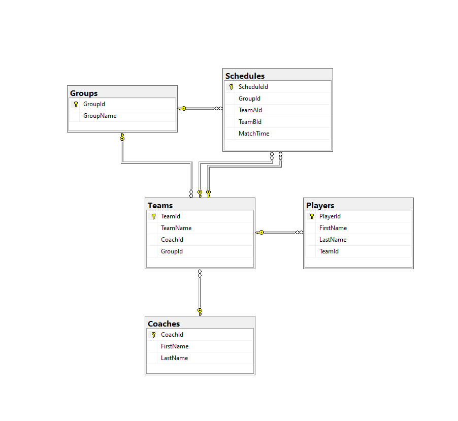

## 1. Схема базы данных (ER-диаграмма)
*Ниже представлен скриншот из SQL Server Management Studio (SSMS), подтверждающий наличие связей (Foreign Keys) между таблицами.*



---

## 2. SQL Скрипт создания
```sql
CREATE DATABASE SportsLeague;
GO
USE SportsLeague;
GO

CREATE TABLE Coaches(
	CoachId INT PRIMARY KEY IDENTITY(1, 1),
	FirstName NVARCHAR(20) NOT NULL,
	LastName NVARCHAR(30) NOT NULL
);

CREATE TABLE Teams(
	TeamId INT PRIMARY KEY IDENTITY(1, 1),
	TeamName NVARCHAR(60) UNIQUE NOT NULL,
	CoachId INT NOT NULL,
	GroupId INT NOT NULL,
	CONSTRAINT FK_Team_Coach FOREIGN KEY (CoachId) REFERENCES Coaches(CoachId),
	CONSTRAINT FK_Team_Group FOREIGN KEY (GroupId) REFERENCES Groups(GroupId)
);

CREATE TABLE Players(
	PlayerId INT PRIMARY KEY IDENTITY(1, 1),
	FirstName NVARCHAR(20) NOT NULL,
	LastName NVARCHAR(30) NOT NULL,
	TeamId INT NOT NULL,
	CONSTRAINT FK_Player_Team FOREIGN KEY (TeamId) REFERENCES Teams(TeamId)
);

CREATE TABLE Groups(
	GroupId INT PRIMARY KEY IDENTITY(1, 1),
	GroupName NVARCHAR(60) UNIQUE NOT NULL
);

CREATE TABLE Schedules(
	ScheduleId INT PRIMARY KEY IDENTITY(1, 1),
	GroupId INT NOT NULL,
	TeamAId INT NOT NULL,
	TeamBId INT NOT NULL,
	MatchTime DATETIME NOT NULL,
	CONSTRAINT FK_Schedule_Group FOREIGN KEY (GroupId) REFERENCES Groups(GroupId),
	CONSTRAINT FK_Schedule_TeamA FOREIGN KEY (TeamAId) REFERENCES Teams(TeamId),
	CONSTRAINT FK_Schedule_TeamB FOREIGN KEY (TeamBId) REFERENCES Teams(TeamId),
	CONSTRAINT CHK_DifferentTeams CHECK (TeamAId <> TeamBId)
);